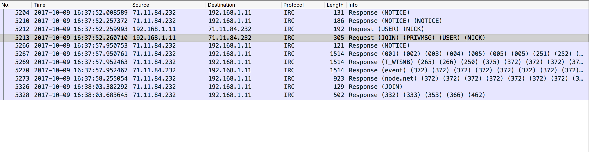
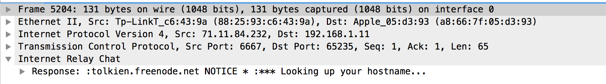
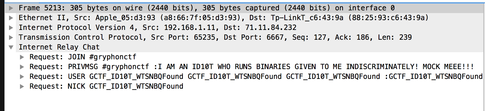
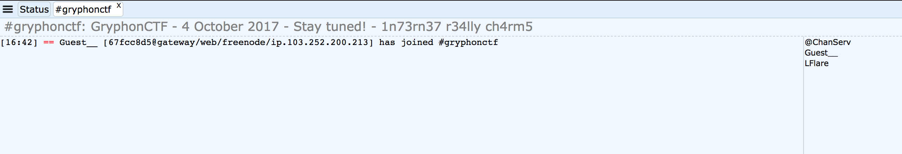
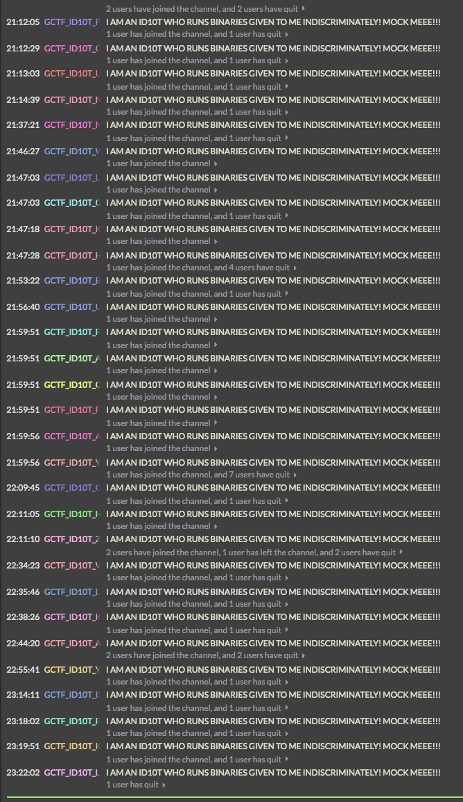

# GryphonCTF_2017: Genesis

**Category:** Reverse
**Points:** 610
**Description:**

>In the beginning, there was nothing.
`nc rev.chal.gryphonctf.com 17234`
`[UPDATE] 5/10/17 02:38PM - Updated distribs`
_Creator - @LFlare_

## Write-up
### Level 1
Level 1 is easily solved by using `$ strings`.

    $ strings genesis
    ...
    ================================================================
                                LEVEL %02d                              
    ================================================================
    Enter secret code: 
    7h15 15 4 h1dd3n 57r1n6
    GCTF{FLAG_ONE}
    ...

Of course the flags are fake but what's important is the line after `Enter secret code:` and entering it into the input for level 1 gives us the flag. Note that the server binary will have the actual flag.

    ================================================================
                                LEVEL 01                              
    ================================================================
    Enter secret code: 7h15 15 4 h1dd3n 57r1n6
    GCTF{w3lc0m3_70_r3v3r53_3n61n33r1n6}

### Level 2
Level 2 is slightly more complicated in that there's a difference between creating a char array like `char *challenge` and `char challenge[]`, with that the latter cannot be `strings`ed. So, to solve this, all you have to do is view the little-endian ASM source code.

    level_two:
    ...
    0804869c         mov        dword [ebp+var_45], 0x6e316837
    080486a3         mov        dword [ebp+var_41], 0x366e316b
    080486aa         mov        dword [ebp+var_3D], 0x37317720
    080486b1         mov        dword [ebp+var_39], 0x6e312068
    080486b8         mov        dword [ebp+var_35], 0x33363337
    080486bf         mov        dword [ebp+var_31], 0x31213572

If you combined all the hexadecimal numbers while taking care to note the little-endianess of it, you will get something like,

    0x3768316e
    0x6b316e36
    0x20773137
    0x6820316e
    0x37333633
    0x72352131

With that, a simple decode to ASCII nets you `7h1nk1n6 w17h 1n7363r5!1`, entering of which into the server gives you the correct flag.

    ================================================================
                                LEVEL 02                              
    ================================================================
    Enter secret code: 7h1nk1n6 w17h 1n7363r5!1
    GCTF{ch4r_p01n73r5_!=_ch4r_4rr4y}

### Level 3
Level 3 gets slightly more tricky with bit manipulations especially the extremely 'wayang' `tumbalek` function, which if you still haven't realized, just takes the binary representation of the char and flips it around. Additionally, with the way GCC compiles, the initialized `challenge` variable is stored in the `.rodata` section.

    level_three:
    ...
    080487dc         lea        eax, dword [ebp+var_60]
    080487df         mov        ebx, 0x8048b20
    080487e4         mov        edx, 0x11
    ...

Following the address `0x8048b20` brings you to the start of the int array. It is important to note that since `int` is `4` bytes long, you have to count manually 4 bytes, in little-endian too!

    08048b20         db  0x4e ; 'N'                                                 ; DATA XREF=level_three+28
    08048b21         db  0x00 ; '.'
    08048b22         db  0x00 ; '.'
    08048b23         db  0x00 ; '.'
    08048b24         db  0xcc ; '.'
    08048b25         db  0xff ; '.'
    08048b26         db  0xff ; '.'
    08048b27         db  0xff ; '.'
    08048b28         db  0x6e ; 'n'
    08048b29         db  0x00 ; '.'
    08048b2a         db  0x00 ; '.'
    08048b2b         db  0x00 ; '.'
    08048b2c         db  0xcc ; '.'
    08048b2d         db  0xff ; '.'
    08048b2e         db  0xff ; '.'
    08048b2f         db  0xff ; '.'

The above roughly translates to

    0x4E, 0xFFFFFFCC, 0x6E, 0xFFFFFFCC

This will continue until you reach

    08048b64         db         "GCTF{FLAG_ONE}", 0                                 ; DATA XREF=sub_80488d6+49
    08048b73         db         "GCTF{FLAG_TWO}", 0

Of course, now that you have the hexadecimal, you can simply solve the puzzle by taking the binary representation, flipping it to reveal the original string `r3v3r53 3n61n33r5`.

    ================================================================
                                LEVEL 03                              
    ================================================================
    Enter secret code: r3v3r53 3n61n33r5
    GCTF{r3v3r51n6_b175_4r3_c00l}

### Level 4
This level gets slightly harder, with a weird function called `ordinal`. With pseudo-code, you get something like 

    int ordinal(int arg0) {
        var_1C = arg0;
        var_10 = 0x0;
        while (var_1C > 0x0) {
                var_10 = var_10 + (var_1C & 0x1);
                var_1C = SAR(var_1C, 0x1);
        }
        eax = var_10;
        edx = *0x14 ^ *0x14;
        if (edx != 0x0) {
                eax = __stack_chk_fail();
        }
        return eax;
    }

This is of course, not easy to understand what's going on behind the scenes, but essentially, it seems to be returning `var_10`, or the sumation of `var_1C & 0x1`, while shifting bits right every loop. In summary, this seems to be a bit-counter, of sorts. What are we counting?

    level_four:
    080492ac         push       ebp
    080492ad         mov        ebp, esp
    080492af         sub        esp, 0x58
    080492b2         mov        eax, dword [gs:0x14]
    080492b8         mov        dword [ebp+var_C], eax
    080492bb         xor        eax, eax
    080492bd         mov        dword [ebp+var_19], 0x46544347
    080492c4         mov        dword [ebp+var_15], 0x4f4f545f
    080492cb         mov        dword [ebp+var_11], 0x4e55465f
    ...

Interesting, now we have something to work with. Remember, Intel x86 is mostly little-endian, so we have to read this little-endian.

    0x47 0x43 0x54 0x46 | 0x5f 0x54 0x4f 0x4f | 0x5f 0x45 0x55 0x4e

Let's do some bit counting!
    
    0b1000111 0b1000011 0b1010100 0b1000110
    4 3 3 3

Repeat this for the other two parts and you get,

    4 3 3 3 | 6 3 5 5 | 6 3 4 4

Let's try entering this on the server

    ================================================================
                                LEVEL 04                            
    ================================================================
    Enter secret code: 4 3 3 3 6 3 5 5 6 3 4 4
    GCTF{b17_7w1ddl1n6_f1x3d_f0r_r34lz_n0w}

### Level 5
Level 5 is the slight pinnacle of Genesis, with the introduction of assembly as well as the art of transpiling. We find this mess of a code

    int level_five() {
        printf(*banner, 0x5);
        stack[2026] = &var_20 + 0x10;
        __isoc99_scanf(0x8049abc, &var_20, &var_20 + 0x4, &var_20 + 0x8, &var_20 + 0xc, stack[2026]);
        esp = ((esp - 0x10) + 0x10 - 0x20) + 0x20;
        do {
        } while (getchar() != 0xa);
        var_38 = 0x0;
        goto loc_80495c5;

    loc_80495c5:
        if (var_38 <= 0x4) goto loc_804956b;

    loc_80495cb:
        eax = 0x1;
        goto loc_80495d0;

    loc_80495d0:
        ecx = *0x14 ^ *0x14;
        if (ecx != 0x0) {
                eax = __stack_chk_fail();
        }
        return eax;

    loc_804956b:
        asm { fld        dword [ebp+eax*4+var_20] };
        esp = (esp - 0xc) + 0xfffffffc;
        asm { fstp       dword [esp+0x54+var_54] };
        fov(stack[2026]);
        esp = (esp + 0x10 - 0x8) + 0xfffffff8;
        asm { fstp       qword [esp+0x4c+var_4C] };
        round(stack[2028]);
        esp = esp + 0x10;
        asm { fnstcw     word [ebp+var_3A] };
        asm { fldcw      word [ebp+var_3C] };
        asm { fistp      dword [ebp+var_40] };
        asm { fldcw      word [ebp+var_3A] };
        if (var_40 == *(ebp + var_38 * 0x4 + 0xffffffcc)) goto loc_80495c1;

    loc_80495ba:
        eax = 0x0;
        goto loc_80495d0;

    loc_80495c1:
        var_38 = var_38 + 0x1;
        goto loc_80495c5;
    }

As well as 5 integers, `3, 1, 3, 3, 7`. We some some calls to a weird function called `fov`, let's take a look.

    fov:
    080493ef         push       ebp
    080493f0         mov        ebp, esp
    080493f2         sub        esp, 0x48
    080493f5         mov        eax, dword [ebp+arg_0]
    080493f8         mov        dword [ebp+var_3C], eax
    080493fb         mov        eax, dword [gs:0x14]
    08049401         mov        dword [ebp+var_C], eax
    08049404         xor        eax, eax
    08049406         fld        dword [_IO_stdin_used+768]]
    0804940c         fstp       dword [ebp+var_24]
    0804940f         fld        dword [ebp+var_3C]
    08049412         fmul       dword [ebp+var_24]
    08049415         fnstcw     word [ebp+var_3E]
    08049418         movzx      eax, word [ebp+var_3E]
    0804941c         mov        ah, 0xc
    0804941e         mov        word [ebp+var_40], ax
    08049422         fldcw      word [ebp+var_40]
    08049425         fistp      dword [ebp+var_20]
    08049428         fldcw      word [ebp+var_3E]
    0804942b         mov        eax, dword [ebp+var_20]
    0804942e         shl        eax, 0x3
    08049431         mov        edx, 0x8504f35f
    08049436         sub        edx, eax
    08049438         mov        eax, edx
    0804943a         mov        dword [ebp+var_1C], eax
    0804943d         fld        dword [ebp+var_3C]
    08049440         fld        dword [_IO_stdin_used+772]
    08049446         fmulp      st1
    08049448         fstp       dword [ebp+var_18]
    0804944b         fld        dword [ebp+var_3C]
    0804944e         fstp       dword [ebp+var_28]
    08049451         mov        eax, dword [ebp+var_1C]
    08049454         shl        eax, 0x2
    08049457         mov        dword [ebp+var_48], eax
    0804945a         fild       dword [ebp+var_48]
    0804945d         fstp       dword [ebp+var_14]
    08049460         lea        eax, dword [ebp+var_28]
    08049463         mov        eax, dword [eax]
    08049465         mov        dword [ebp+var_2C], eax
    08049468         mov        eax, dword [ebp+var_2C]
    0804946b         mov        dword [ebp+var_1C], eax
    0804946e         fld        dword [ebp+var_28]
    08049471         fld        dword [ebp+var_28]
    08049474         fmulp      st1
    08049476         fmul       dword [ebp+var_18]
    08049479         fldcw      word [ebp+var_40]
    0804947c         fistp      dword [ebp+var_44]
    0804947f         fldcw      word [ebp+var_3E]
    08049482         mov        eax, dword [ebp+var_44]
    08049485         mov        dword [ebp+var_2C], eax
    08049488         mov        eax, dword [ebp+var_1C]
    0804948b         sar        eax, 0x1
    0804948d         mov        edx, 0x5f3759df
    08049492         sub        edx, eax
    08049494         mov        eax, edx
    08049496         mov        dword [ebp+var_2C], eax
    08049499         lea        eax, dword [ebp+var_2C]
    0804949c         fld        dword [eax]
    0804949e         fstp       dword [ebp+var_28]
    080494a1         fld        dword [ebp+var_3C]
    080494a4         fadd       dword [ebp+var_24]
    080494a7         fldcw      word [ebp+var_40]
    080494aa         fistp      dword [ebp+var_10]
    080494ad         fldcw      word [ebp+var_3E]
    080494b0         fld        dword [ebp+var_28]
    080494b3         fmul       dword [ebp+var_18]
    080494b6         fld        dword [ebp+var_28]
    080494b9         fmulp      st1
    080494bb         fld        dword [ebp+var_24]
    080494be         fsubrp     st1
    080494c0         fld        dword [ebp+var_28]
    080494c3         fmulp      st1
    080494c5         fstp       dword [ebp+var_28]
    080494c8         fld        dword [ebp+var_28]
    080494cb         mov        eax, dword [ebp+var_C]
    080494ce         xor        eax, dword [gs:0x14]
    080494d5         je         loc_80494de
    080494d7         fstp       st0
    080494d9         call       j___stack_chk_fail
    080494de         leave

Mother Mary, this is assembly hell! Or is it? This from an overview looks like something too incredulous to reverse, but is it? The binary is intentionally optimized by the compiler to produce more pure assembly lines than normal! Let's try to see what we can dig up.

We have two numbers, `0x8504f35f`, `0x5f3759df`. The number one tip I follow to make my life easier is to always Google any numbers I find, perhaps the creator copied something off the internet? Unfortunately, `0x8504f35f` brings up nothing but `0x5f3759df` surprisingly brings up a Wikipedia article on [Fast Inverse Square Root](
https://en.wikipedia.org/wiki/Fast_inverse_square_root). 

Interesting, let's see if we can apply the FISR in C using the code we found online!
    
    #include <stdio.h>
    #include <math.h>

    float FastInvSqrt(float x) {
      float xhalf = 0.5f * x;
      int i = *(int*)&x;         // evil floating point bit level hacking
      i = 0x5f3759df - (i >> 1);  // what the fuck?
      x = *(float*)&i;
      x = x*(1.5f-(xhalf*x*x));
      return x;
    }

    int main() {
        int numbers[] = {3, 1, 3, 3, 7};
        for (int x = 0; x < 5; x++) {
            for (float y = 0; y < 1; y+=0.01) {
                if ((int)round(FastInvSqrt(y)) == numbers[x]) {
                    printf("%.2f ", y);
                    break;
                }
            }
        }
    }

[Running this](https://ideone.com/Z6Axi2), gives us the following
    
    0.09 0.45 0.09 0.09 0.02

Let's try entering this,

    ================================================================
                                LEVEL 05                              
    ================================================================
    Enter secret code: 0.09 0.45 0.09 0.09 0.02
    GCTF{1nv3r53_r0075_m4d3_1n3ff1c13n7}

### Level 6
Level 6 is the _creme de la crop_ of Genesis, also known as the boss level or level **99**. I originally created this challenge with intention of crushing any pro reverse engineers, do not feel too bad if you can't solve this, it's not a conventional challenge either.

This challenge starts with the `bonus()`. It looks like a rehash of `level_two` but it is far from it. You might think to enter `d1d y0u 7h1nk 7h15 w0uld b3 345y?` as the secret code but it is anything but this easy. The key to solving this challenge is to debug the entire program. From there, you might come across weird functions references to `socket` or `pthread_create`. Pay attention now, because those are very important.

When reverse engineering anything, always ask yourself if anything is related to anything else. Why would a binary have `socket` or `pthread`? Well, let's try sniffing it.

Interesting, IRC traffic towards Freenode, on a channel `#gryphonctf`.

Oh look, it's me. Look at the MOTD, interesting words `1n73rn37 r34lly ch4rm5`. Hmmm...

    ================================================================
                                LEVEL 99                              
    ================================================================
    Enter secret code: 1n73rn37 r34lly ch4rm5
    GCTF{1rc_15_p0pul4r_4m0n6_c7f_pl4y3r5_700}

Bingo!

Therefore, the flags are,
1. `GCTF{w3lc0m3_70_r3v3r53_3n61n33r1n6}`
2. `GCTF{ch4r_p01n73r5_!=_ch4r_4rr4y}`
3. `GCTF{r3v3r51n6_b175_4r3_c00l}`
4. `GCTF{b17_7w1ddl1n6_f1x3d_f0r_r34lz_n0w}`
5. `GCTF{1nv3r53_r0075_m4d3_1n3ff1c13n7}`
6. `GCTF{1rc_15_p0pul4r_4m0n6_c7f_pl4y3r5_700}`

### Fun Facts

